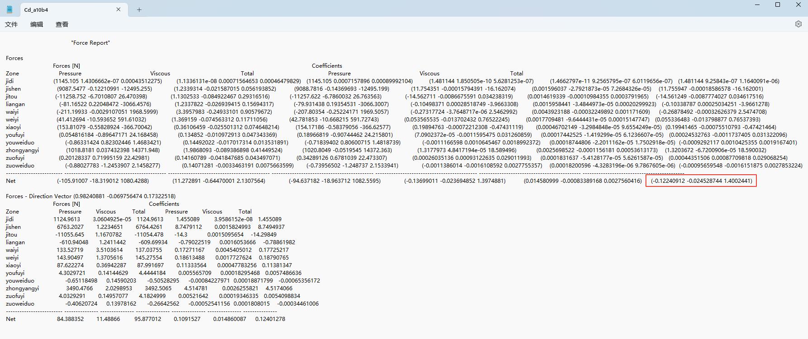
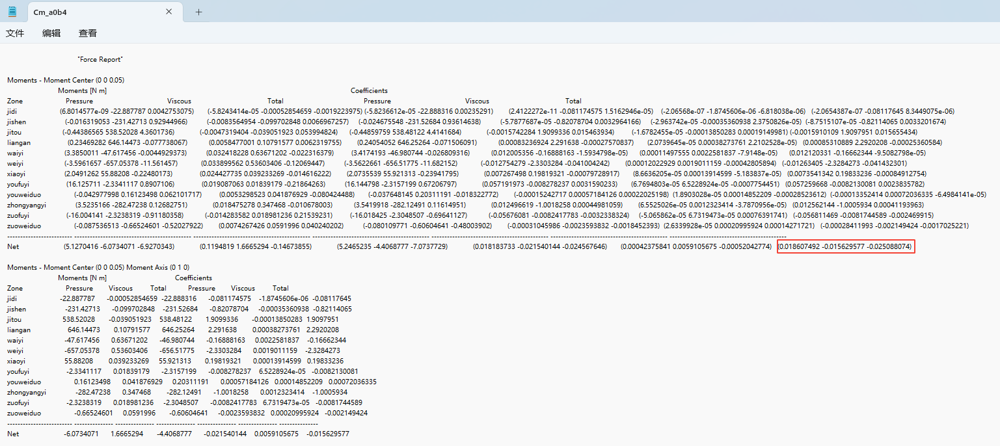

# 气动数据使用说明

某50kg垂起无人机气动库数据主要包含：

- 基础构型数据库，无起落架、无舵面偏转（basic文件夹）
- 起落架数据库（landgear文件夹）
- 右副翼偏转数据库（right-aileron文件夹）
- 左副翼偏转数据库（left-aileron文件夹）
- 右尾翼偏转数据库（right-rudder文件夹）
- 左尾翼偏转数据库（left-rudder文件夹）。

> 对于副翼偏转和尾翼偏转文件夹其下包含舵偏转不同角度的子文件夹，舵偏转方向均是以尾缘上偏转为负，下偏转为正，youfuyi文件夹下的duo-20文件夹表示是右副翼偏转-20°，即右副翼尾缘向上偏转20°。

## 文件命名方式

气动数据计算结果文件类命名形式：

- Cd开头的为气动力系数数据文件
- Cm开头的文件为力矩系数数据文件

> 文件后面的a表示是攻角，b表示的是侧滑角，如文件`Cd_a10b12`表示的是攻角10°侧滑角12°的气动力系数数据文件，`Cm_a0b8`表示的是攻角0°侧滑角8°的气动力矩系数数据文件。

## 气动系数提取

对于气动力系数数据文件，其内的数据内容如下图所示，需要提取使用的数据为第一个“Net”字符串行最后的括号内的三个数据，分别是无人机在该文件名对应下的状态的x/y/z三个方向的气动力系数。

对于气动力矩系数数据文件，其内的数据内容如下图所示，需要提取使用的数据为第一个“Net”字符串行最后的括号内的三个数据，分别是无人机在该文件名对应下的状态的x/y/z三个方向的气动力矩系数。

数据库文件中的数的坐标系均是相对于来流坐标系（x轴沿机体轴心向后，y轴飞行员视角向右，z轴垂直于xy平面向上），对于气动力系数和力矩系数文件的使用需要依据情况其将转换至体轴系（x轴沿机体轴心向前，y轴飞行员视角向右，z轴垂直于xy平面向下）。

## 气动系数计算

首先：由于数据计算时，采用的是单片控制舵面偏转的方式，无侧滑角时，右副翼偏转与左副翼偏转相同度数、右尾翼偏转与左尾翼偏转相同度数无人机的气动状态应是沿竖直平面对称的情况，为节约计算资源，对左尾翼与左副翼的偏转均未计算0°侧滑的情况，其数据可以对应舵偏角的右尾翼与右副翼数据转换得到。
转换规律为：x/z方向的力相等，y方向的力反向，x/z轴的力矩方向，y轴的力矩相等。

其次：由于在初始气动力计算时，未考虑无人机脚垫，在结构设计完成后由于无人机增加了脚垫，将脚垫的气动影响作为增量的形式考虑，用有脚垫的气动数据减去基础气动数据得到脚垫引起的增量的气动数据。

再次：在进行舵效分析时需要得到不同舵偏角时无人机对应的气动参数的增量。用不同舵偏角不同的攻角侧滑角的气动参数减去0°舵偏时对应的攻角侧滑角的气动参数，得到不同舵偏情况下不同攻角与侧滑角对应的气动增量。由于控制面偏转的气动计算模型均没有脚垫，考虑无人机飞行的实际情况，将得到的舵偏的增量加上增加脚垫后的增加作为实际的舵偏增量。

最后：基于无人机控制时的舵偏情况，对得到的无人机不同舵偏情况的气动增量进行组合，得到无人机的在对应的控制情况的总的气动增量。
在进行控制面控制时，以产生负力矩为正舵偏，例如滚转5°的舵偏情况为左右副翼差动偏转5°，使无人机产生负滚转力矩的舵偏情况的气动数据相加，就得到该舵偏控制的气动增量。
